# 数据结构（Go 实现）入门友好版

面向初学者的快速导览：按数据结构/算法梳理原理、常见应用场景，并用 mermaid 示意核心流程。仓库代码基于 Go，可直接运行示例或调试练习。

## 快速上手

- 环境：推荐 Go 1.20+。
- 运行示例/测试：在仓库根目录执行 `go test ./...`（如仅阅读代码可跳过）。
- 阅读顺序：按下文模块循序渐进；每个模块先理解原理与场景，再结合对应目录下代码。

## 模块导航

- 单向链表：`Linked`
- 双向链表与缓存：`DoubleLinked`
- 栈与队列：`stack`、`queue`、`main/622.go`
- 图论：`Graph_algo`
- 二叉搜索树：`BinarySearch`
- AVL 自平衡搜索树：`AVL`
- 红黑树：`Red-Black`
- 线段树：`Segment`
- 并查集：`Union`
- 堆/优先队列：`Heap`
- 字典树：`Trie`
- 排序算法：`Sorts`
- 其他练习：基础语法与并发特性 `BasicGo`，组合工具 `pkg`/`Utils`，Web 实战 `webdemo`

> 说明：Go 内建 `slice`/`map` 已覆盖动态数组、栈/队列基础版本，本仓库更关注手写实现与算法练习。

---

## 线性结构与缓存

### 单向链表（`Linked`）

- 原理：节点通过 `next` 串联，适合频繁插入/删除但不擅长随机访问。
- 场景：LRU 近似链、任务调度链、反转子区间、判环、合并有序链等。

| 算法                | 原理                                       | 常用场景             |
| ------------------- | ------------------------------------------ | -------------------- |
| 链表反转（1.1）     | 三指针 `prev-cur-next` 迭代反转指向      | 反转整表或子区间     |
| 去重（1.2）         | 哈希或快慢指针跳过重复节点                 | 清洗有序/无序链      |
| 链表加法（1.3）     | 同步遍历两链表，维护进位                   | 大整数逐位相加       |
| 中段反转（1.4）     | 快慢指针找中点，局部反转                   | 回文链判定、半程旋转 |
| 倒数第 k（1.5）     | 双指针错位 k 步，同步前进                  | 单次遍历定位节点     |
| 判环/入口（1.6）    | Floyd 快慢指针相遇，再从头同步找入口       | 检测闭环、死链       |
| 两两反转（1.7）     | 以 2 为步长交换指向，`dummy` 便捷拼接    | 配对翻转、分组洗牌   |
| 前 k 反转（1.8）    | 先截断第 k+1 节点，再复用反转              | 仅处理前缀区间       |
| 合并有序链（1.9）   | 双指针比较最小值拼接                       | 归并排序链表版       |
| O(1) 删节点（1.10） | 用后继覆盖当前，再跳过后继（尾节点需顺扫） | 已知指针快速删除     |
| 判交叉（1.11）      | 先对齐长度，再同步比较地址                 | 判断共享尾段         |

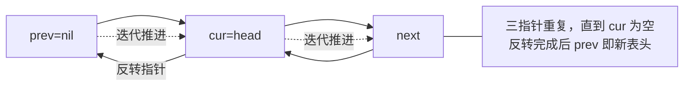

### 双向链表与缓存（`DoubleLinked`）

- 原理：节点有 `prev/next`，可 O(1) 从任意位置删除；结合哈希表可实现缓存淘汰。
- 场景：LRU/LFU/FIFO 缓存、最近使用记录、队列双端操作。

| 算法 | 原理                                           | 常用场景         |
| ---- | ---------------------------------------------- | ---------------- |
| LRU  | 哈希存键→节点，命中移到表头，满时淘汰尾节点   | 本地缓存、连接池 |
| LFU  | 维护频率桶（freq→双链表），淘汰最小频率尾节点 | 热点数据维持     |
| FIFO | 单纯按写入顺序淘汰尾节点                       | 简单队列替换     |

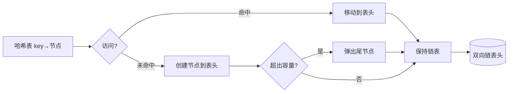

### 栈与队列（`stack`，`queue`）

- 原理：栈后进先出，队列先进先出，可用切片或数组循环队列实现。
- 场景：括号匹配、BFS 辅助队列、任务排队、窗口滑动。

| 算法         | 原理                                         | 常用场景       |
| ------------ | -------------------------------------------- | -------------- |
| 括号匹配     | 左括号入栈，遇右括号检查栈顶                 | 表达式校验     |
| 循环队列     | `front/rear` 取模循环，`size` 判断空满   | 固定长度缓冲   |
| LeetCode 622 | 提供标准 `EnQueue/DeQueue/Front/Rear` 接口 | 在线评测题模板 |

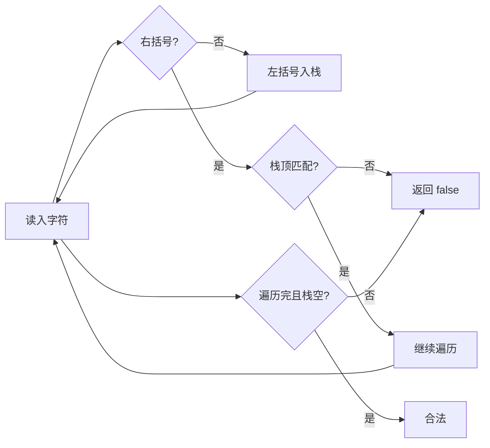

---

## 图与树结构

### 图（`Graph_algo`）

- 原理：用邻接表存图，BFS 层序扩展，DFS 深度回溯。
- 场景：最短路径（无权）、连通分量、拓扑排序、遍历。

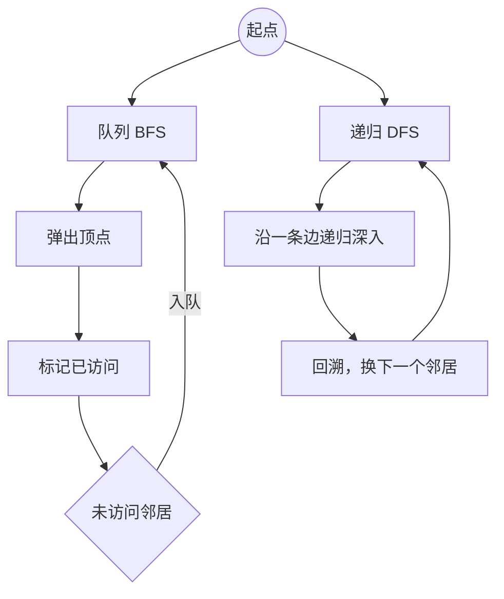

### 二叉搜索树（`BinarySearch`）

- 原理：左子树 < 根 < 右子树；插入/查找/删除都基于递归或迭代比较。
- 场景：有序字典、范围查询、自动排序。

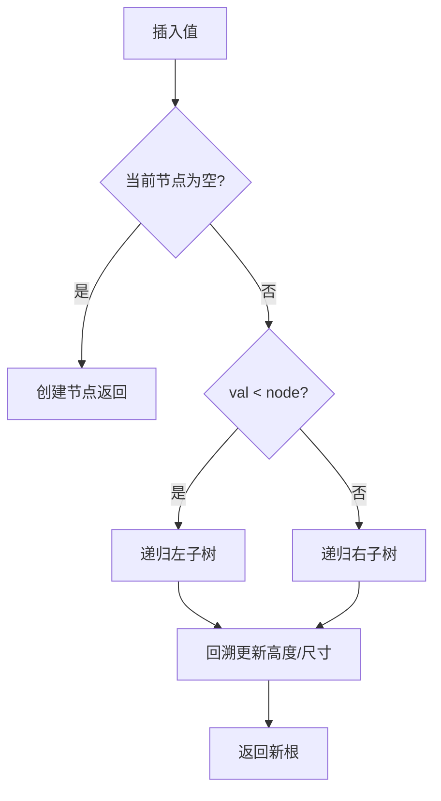

### AVL（`AVL`）

- 原理：在 BST 基础上维护高度，平衡因子保持在 \|1\| 内，失衡时通过 LL/LR/RL/RR 旋转恢复。
- 场景：查询/插入/删除都要求稳定 O(log n) 的有序集合。

| 操作             | 原理                                          | 常用场景             |
| ---------------- | --------------------------------------------- | -------------------- |
| 插入/删除        | 更新高度并检查平衡因子，触发 LL/LR/RL/RR 旋转 | 持续写入但需稳定查询 |
| 查找（Contains） | 按 BST 左小右大递归查找                       | 有序字典、索引       |
| IsBalanced/IsBST | 中序递增校验 + 高度差检查                     | 调试断言、单测验证   |
| InOrder          | 中序遍历输出升序数组                          | 结果校验、遍历输出   |

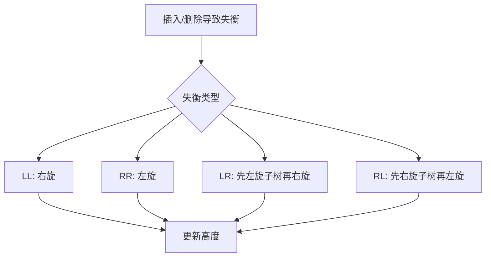

```go
// 用法示例（假设已导入包 AVL）
tree := &AVL.Tree{}
for _, v := range []int{30, 20, 40, 10, 25, 35, 50} {
    tree.Add(v)
}
tree.Remove(25)
fmt.Println(tree.Contains(40), tree.IsBalanced()) // true, true
fmt.Println(tree.InOrder())                       // 升序序列
```

> 单测：`AVL/Tree_test.go` 覆盖有序插入与多次删除后的平衡性和有序性。

### 红黑树（`Red-Black`）

- 原理：近似 2-3 树，保持「根黑、叶黑空节点、不能有连续红、每条路径黑高相同」；插入时通过旋转+变色恢复平衡。
- 场景：语言/库中的有序映射（如 `TreeMap` 同类）。

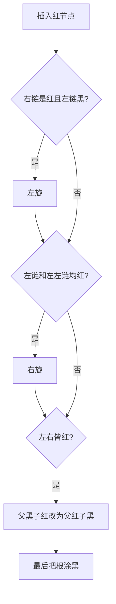

### 线段树（`Segment`）

- 原理：用 4 倍空间存树，节点代表区间，内部节点值由左右子区间聚合。
- 场景：区间查询/更新（求和、最值等）在 O(log n) 内完成。

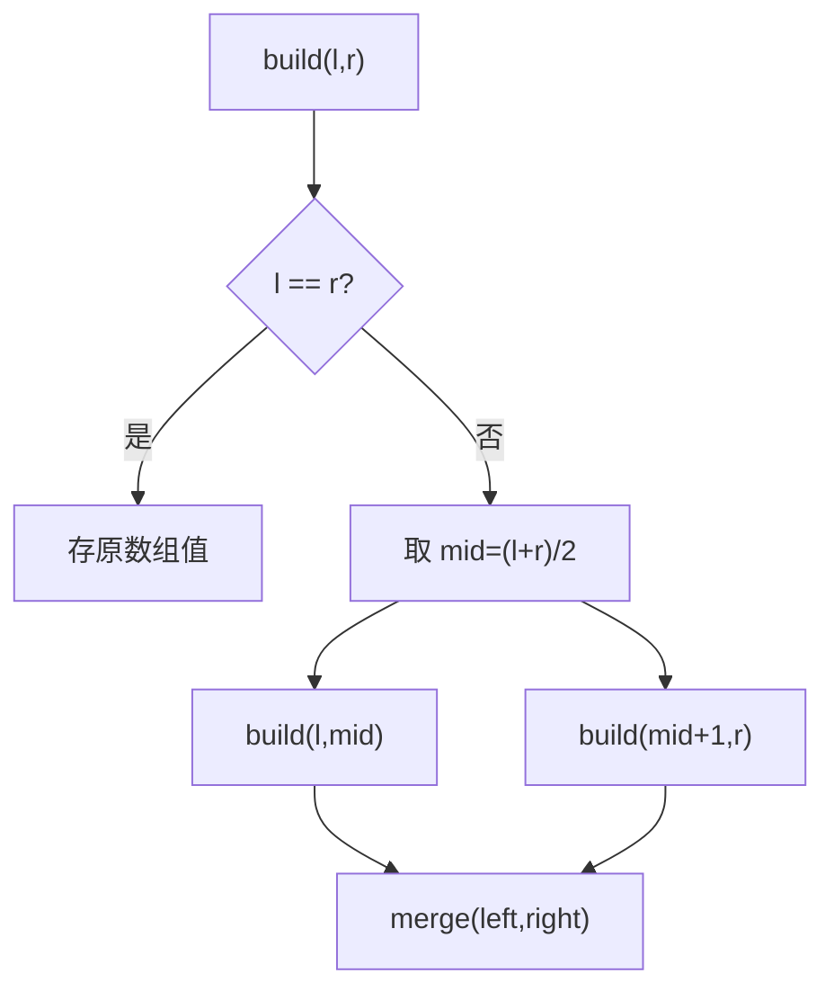

### 字典树（`Trie`）

- 原理：字符逐层建节点，前缀共享；节点可标记「单词结束」。
- 场景：前缀搜索、自动补全、敏感词过滤。

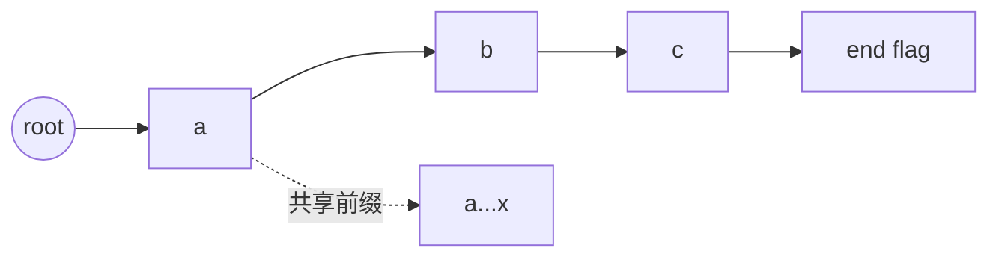

---

## 优先结构与并查集

### 堆与优先队列（`Heap`）

- 原理：完全二叉树用数组存储，父节点大于（或小于）子节点；插入用上浮，删除堆顶用下沉。
- 场景：TopK、调度队列、Dijkstra 优先队列。

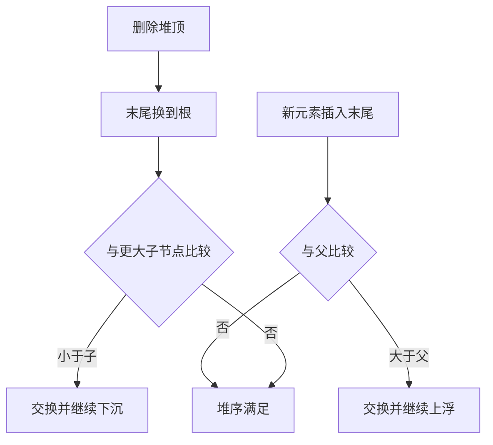

### 并查集（`Union`）

- 原理：`parent` 数组记录父节点，`find` 路径压缩，`union` 按树高/尺寸合并。
- 场景：连通性判断、最小生成树 Kruskal、社交关系分组。

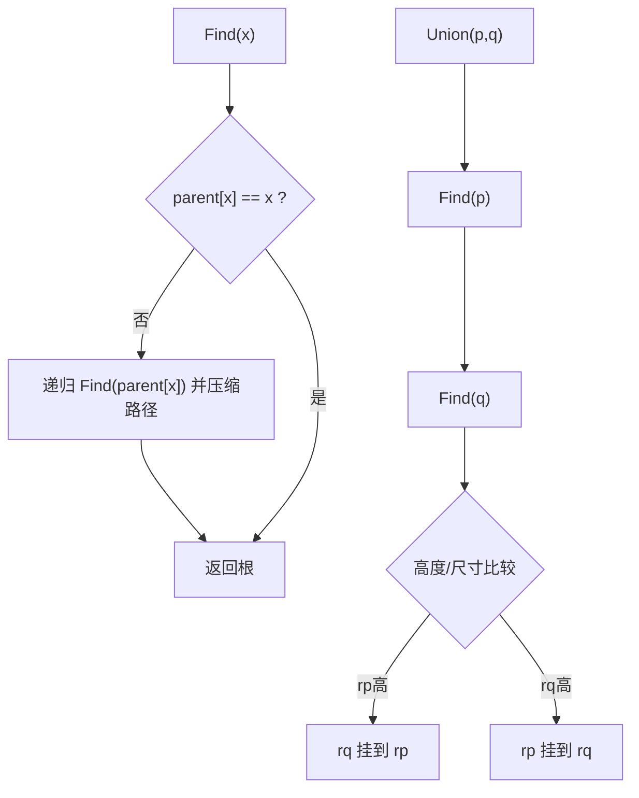

---

## 排序与其他

### 排序算法（`Sorts`）

| 算法     | 原理                                | 常用场景                         |
| -------- | ----------------------------------- | -------------------------------- |
| 冒泡排序 | 相邻比较，较大元素逐步冒到末尾      | 数据量小、教学演示               |
| 插入排序 | 已排序序列中寻找位置插入当前元素    | 小规模、近乎有序数组             |
| 选择排序 | 在未排序区选最小值放到当前位        | 交换次数少、实现简单             |
| 归并排序 | 分治拆分再有序归并，稳定 O(n log n) | 大数据排序、链表排序             |
| 快速排序 | 选 pivot 分区递归，平均 O(n log n)  | 通用数组排序（注意随机化 pivot） |
| 希尔排序 | gap 分组做插入排序，逐步缩小 gap    | 需要较快但实现简单的就地排序     |


---

## 参考与建议

- 先读「原理 + 场景 + mermaid」，再对照对应目录代码，最后自己改写/调试。
- 每个模块都保持 KISS/DRY：理解通用模板（如「三指针反转」「map + 双链表」），然后复用到具体题目。
- 尚未在仓库实现的 AVL，可按上文思路自行补全并写单元测试。
