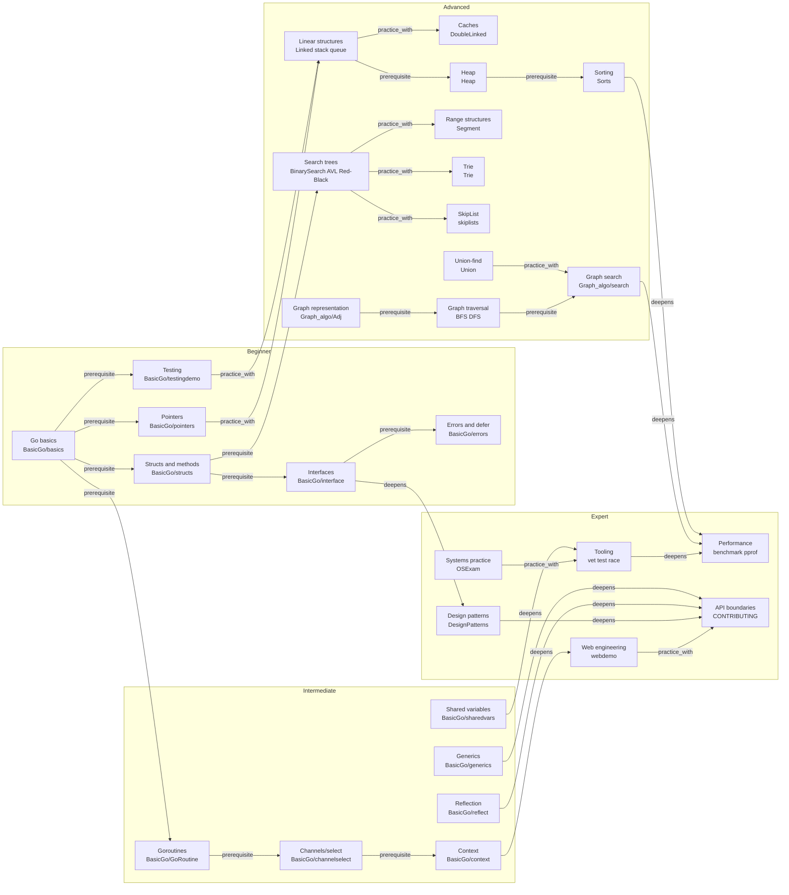

# Knowledge Graph

This graph connects Go language mechanics, data structures, algorithms, and engineering skills. Edge meanings:

- `prerequisite`: learn this first.
- `practice_with`: use this module to practice the earlier concept.
- `deepens`: move from concept knowledge toward engineering judgment.

Structured data is available in [docs/data/knowledge-graph.json](data/knowledge-graph.json).

The core learning-spine nodes link to textbook-style module chapters. Those chapters contain the local mental model, invariants, complexity derivation, exercises, hints, reference answers, and test commands for the topic.

## Node Index

| Level | Nodes | Repository paths |
| --- | --- | --- |
| Beginner | Basics, testing, pointers, structs, interfaces, errors | [BasicGo](../BasicGo/) |
| Intermediate | Goroutines, channels, context, shared variables, generics, reflection | [BasicGo](../BasicGo/) |
| Advanced | Lists, queues, heap, trees, graphs, sorting, Trie, SkipList, union-find | [Linked](../Linked/), [DoubleLinked](../DoubleLinked/), [Heap](../Heap/), [Union](../Union/), [Graph_algo](../Graph_algo/), [Sorts](../Sorts/) |
| Expert | Patterns, Web demos, systems practice, tooling, performance, API boundaries | [DesignPatterns](../DesignPatterns/), [webdemo](../webdemo/), [OSExam](../OSExam/), [CONTRIBUTING.md](../CONTRIBUTING.md) |

## Maintenance Rule

When a new module is added, update this Mermaid graph and [knowledge-graph.json](data/knowledge-graph.json) in the same change.
